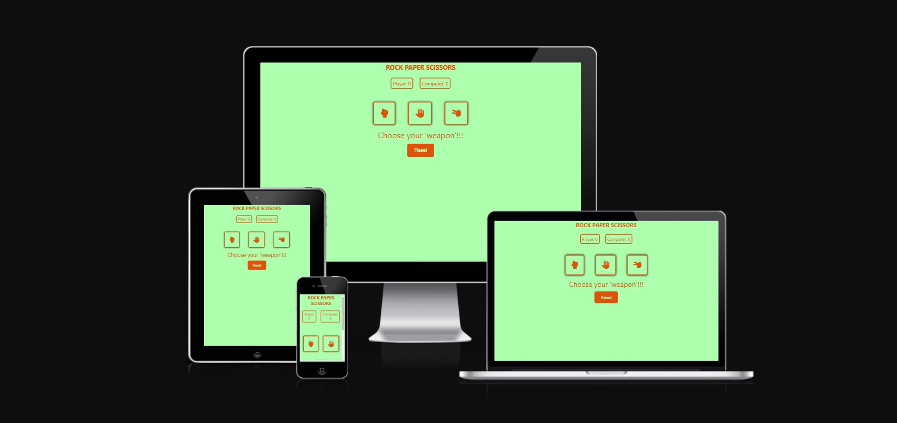
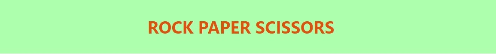
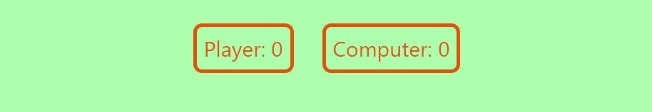
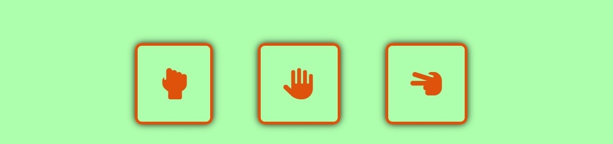
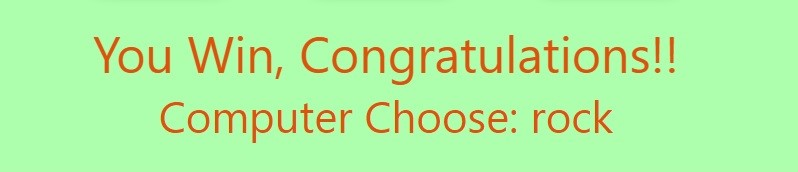
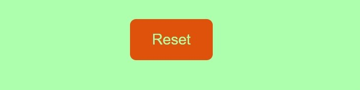
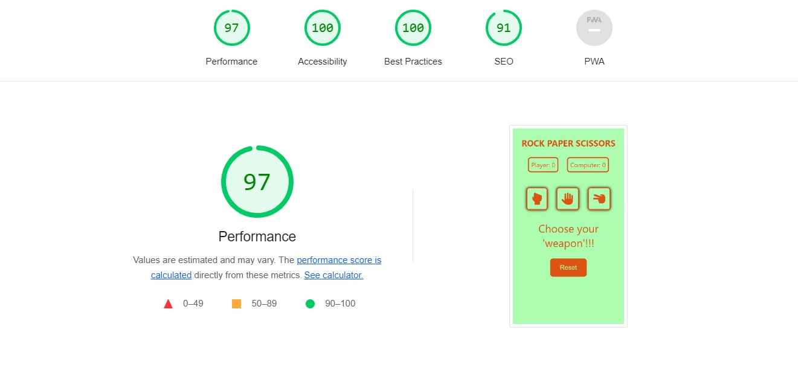

# ROCK PAPER SCISSORS
 If you're looking to make a quick decision and leave it all to chance or to try and beat true randomness [ROCK PAPER SCISSORS](https://felixsvenharry.github.io/PP2-rock-paper-scissors/) is for you. Play against an opponent that will never tire and always give 100%!

## FEATURES
---
- ### HEADER
  - With it's simplistic font, the Header serves the purpous of immediatly informing the user of that's to be expected as well as keep in line with the overall theme of the website.

- ### SCOREBOARD
  - The scoreboard clearly indicates The two players playing this game: the plyer and the computer.
  - Once a choice has been made, as lon as it's not a tie, the scoreboard will indicate which player earned the point.

- ### CHOICE BUTTONS
  - The choice buttons represent the three different choices the user can make. Rock, paper or scissor. 
  - The buttons are responsive when hovering over so it's clear that a choice needs to me made.

- ### RESULT TEXT
  - The result text will show the user both wheter the turn resulted in a win, a loss, or a tie. But also What move the computer made.

- ### RESET BUTTON
  - The reset button, located at the bottom of the game screen, resets both the scoreboard as well as the result text, resetting it to its default "Choose your 'weapon'!!!"

- ### FEATURES TO IMPLEMENT
  - Given more time I would like to add the "lizard" and "spock" choices for the [game](https://bigbangtheory.fandom.com/wiki/Rock,_Paper,_Scissors,_Lizard,_Spock) popularized by the tv show "big pang theory"
  - I would like to add a footer that when clicked, expands revealing the rules for the game mentioned above.
### TESTING
---
- I tested the website on Iphone 11, Samsung galaxy s22 and laptop to make sure the website is responsive on differnet ccreen sizes as well as testing it with chrome dev tools.
- I tested the game in Chrome, Safari and Firefox to confirm that it works on multiple different browsers.
- I confirmed that that colors contrast each other well as well as making sure that the fonts are easy to read by running the website through lighthouse.

### BUGS
---
- I had trouble for some time getting the javascript to communicate with the page which turned out was due to referencing the wrong filepath in the HTML file.

### VALIDATOR TESTING
---
- HTML
  - No bugs were found through the W3C validator. (link to the official W3C validator test provided [here](https://validator.w3.org/nu/?doc=https%3A%2F%2Ffelixsvenharry.github.io%2FPP2-rock-paper-scissors%2F)).
- CSS
  - No bugs were found through the jigsaw validator. (link to the official jigsaw validator test provided [here](https://jigsaw.w3.org/css-validator/validator?uri=https%3A%2F%2Ffelixsvenharry.github.io%2FPP2-rock-paper-scissors%2F&profile=css3svg&usermedium=all&warning=1&vextwarning=&lang=sv))
### UNFIXED BUGS
---
There are no unfixed bugs left.
### DEPLOYMENT
  - The site was deployed though GitHub pages. Below is a step by step guide.
    - From the GitHub repository, navigate to the settings tab.
    - In the menu on the left, find the "pages" tab
    - in the source drop down menu, select "deploy from branch".
    - In the branch drop donn menu, select "main".
    - After selecting "save" the website will refresh and a link to the website can be found at the top of the page.

A link to the working website can be found [here](https://felixsvenharry.github.io/PP2-rock-paper-scissors/).

### CREDIT
---
- Prat of the Javascript for calculating the reult as well as the responsiveness for the buttons were taken from a tutorial provided by [codewithfaraz.com](https://www.codewithfaraz.com/content/107/create-rock-paper-scissors-game-with-html-css-and-javascript#final-output).
### MEDIA
- The icons for the buttons were sourced from [Font Awesome](https://fontawesome.com/).